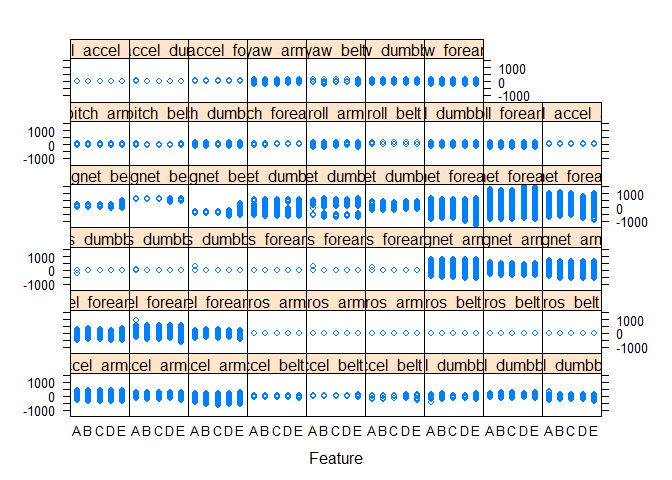

# Final project practical machine learning : Human activity recognition
Cheryf LALEYE  
16 mai 2017  


## Goal of the project

The goal of your project is to predict the manner in which they did the exercise. This is the "classe" variable in the training set. You may use any of the other variables to predict with. You should create a report describing how you built your model, how you used cross validation, what you think the expected out of sample error is, and why you made the choices you did.

## Background

Using devices such as Jawbone Up, Nike FuelBand, and Fitbit it is now possible to collect a large amount of data about personal activity relatively inexpensively. These type of devices are part of the quantified self movement - a group of enthusiasts who take measurements about themselves regularly to improve their health, to find patterns in their behavior, or because they are tech geeks. One thing that people regularly do is quantify how much of a particular activity they do, but they rarely quantify how well they do it. In this project, your goal will be to use data from accelerometers on the belt, forearm, arm, and dumbell of 6 participants. They were asked to perform barbell lifts correctly and incorrectly in 5 different ways. More information is available from the website here: http://groupware.les.inf.puc-rio.br/har (see the section on the Weight Lifting Exercise Dataset).

## Data sources

The training data for this project are available here:

https://d396qusza40orc.cloudfront.net/predmachlearn/pml-training.csv

The test data are available here:

https://d396qusza40orc.cloudfront.net/predmachlearn/pml-testing.csv


## Loading packages 


```r
library(caret)
```

```
## Loading required package: lattice
```

```
## Loading required package: ggplot2
```

```r
library(rattle)
```

```
## Warning: package 'rattle' was built under R version 3.3.3
```

```
## Rattle : une interface graphique gratuite pour l'exploration de données avec R.
## Version 4.1.0 Copyright (c) 2006-2015 Togaware Pty Ltd.
## Entrez 'rattle()' pour secouer, faire vibrer, et faire défiler vos données.
```

```r
library(corrplot)
```

## Loading and reading data


```r
raw.training <- read.table("./pml-training.csv",na.strings=c("NA",""), sep=",", header=T)
raw.testing <- read.table("./pml-testing.csv",na.strings=c("NA",""), sep=",", header=T)

dim(raw.training)
```

```
## [1] 19622   160
```

```r
dim(raw.testing)
```

```
## [1]  20 160
```

Let's tcheck the structure of our training data : 


```r
str(raw.training)
```

```
## 'data.frame':	19622 obs. of  160 variables:
##  $ X                       : int  1 2 3 4 5 6 7 8 9 10 ...
##  $ user_name               : Factor w/ 6 levels "adelmo","carlitos",..: 2 2 2 2 2 2 2 2 2 2 ...
##  $ raw_timestamp_part_1    : int  1323084231 1323084231 1323084231 1323084232 1323084232 1323084232 1323084232 1323084232 1323084232 1323084232 ...
##  $ raw_timestamp_part_2    : int  788290 808298 820366 120339 196328 304277 368296 440390 484323 484434 ...
##  $ cvtd_timestamp          : Factor w/ 20 levels "02/12/2011 13:32",..: 9 9 9 9 9 9 9 9 9 9 ...
##  $ new_window              : Factor w/ 2 levels "no","yes": 1 1 1 1 1 1 1 1 1 1 ...
##  $ num_window              : int  11 11 11 12 12 12 12 12 12 12 ...
##  $ roll_belt               : num  1.41 1.41 1.42 1.48 1.48 1.45 1.42 1.42 1.43 1.45 ...
##  $ pitch_belt              : num  8.07 8.07 8.07 8.05 8.07 8.06 8.09 8.13 8.16 8.17 ...
##  $ yaw_belt                : num  -94.4 -94.4 -94.4 -94.4 -94.4 -94.4 -94.4 -94.4 -94.4 -94.4 ...
##  $ total_accel_belt        : int  3 3 3 3 3 3 3 3 3 3 ...
##  $ kurtosis_roll_belt      : Factor w/ 396 levels "-0.016850","-0.021024",..: NA NA NA NA NA NA NA NA NA NA ...
##  $ kurtosis_picth_belt     : Factor w/ 316 levels "-0.021887","-0.060755",..: NA NA NA NA NA NA NA NA NA NA ...
##  $ kurtosis_yaw_belt       : Factor w/ 1 level "#DIV/0!": NA NA NA NA NA NA NA NA NA NA ...
##  $ skewness_roll_belt      : Factor w/ 394 levels "-0.003095","-0.010002",..: NA NA NA NA NA NA NA NA NA NA ...
##  $ skewness_roll_belt.1    : Factor w/ 337 levels "-0.005928","-0.005960",..: NA NA NA NA NA NA NA NA NA NA ...
##  $ skewness_yaw_belt       : Factor w/ 1 level "#DIV/0!": NA NA NA NA NA NA NA NA NA NA ...
##  $ max_roll_belt           : num  NA NA NA NA NA NA NA NA NA NA ...
##  $ max_picth_belt          : int  NA NA NA NA NA NA NA NA NA NA ...
##  $ max_yaw_belt            : Factor w/ 67 levels "-0.1","-0.2",..: NA NA NA NA NA NA NA NA NA NA ...
##  $ min_roll_belt           : num  NA NA NA NA NA NA NA NA NA NA ...
##  $ min_pitch_belt          : int  NA NA NA NA NA NA NA NA NA NA ...
##  $ min_yaw_belt            : Factor w/ 67 levels "-0.1","-0.2",..: NA NA NA NA NA NA NA NA NA NA ...
##  $ amplitude_roll_belt     : num  NA NA NA NA NA NA NA NA NA NA ...
##  $ amplitude_pitch_belt    : int  NA NA NA NA NA NA NA NA NA NA ...
##  $ amplitude_yaw_belt      : Factor w/ 3 levels "#DIV/0!","0.00",..: NA NA NA NA NA NA NA NA NA NA ...
##  $ var_total_accel_belt    : num  NA NA NA NA NA NA NA NA NA NA ...
##  $ avg_roll_belt           : num  NA NA NA NA NA NA NA NA NA NA ...
##  $ stddev_roll_belt        : num  NA NA NA NA NA NA NA NA NA NA ...
##  $ var_roll_belt           : num  NA NA NA NA NA NA NA NA NA NA ...
##  $ avg_pitch_belt          : num  NA NA NA NA NA NA NA NA NA NA ...
##  $ stddev_pitch_belt       : num  NA NA NA NA NA NA NA NA NA NA ...
##  $ var_pitch_belt          : num  NA NA NA NA NA NA NA NA NA NA ...
##  $ avg_yaw_belt            : num  NA NA NA NA NA NA NA NA NA NA ...
##  $ stddev_yaw_belt         : num  NA NA NA NA NA NA NA NA NA NA ...
##  $ var_yaw_belt            : num  NA NA NA NA NA NA NA NA NA NA ...
##  $ gyros_belt_x            : num  0 0.02 0 0.02 0.02 0.02 0.02 0.02 0.02 0.03 ...
##  $ gyros_belt_y            : num  0 0 0 0 0.02 0 0 0 0 0 ...
##  $ gyros_belt_z            : num  -0.02 -0.02 -0.02 -0.03 -0.02 -0.02 -0.02 -0.02 -0.02 0 ...
##  $ accel_belt_x            : int  -21 -22 -20 -22 -21 -21 -22 -22 -20 -21 ...
##  $ accel_belt_y            : int  4 4 5 3 2 4 3 4 2 4 ...
##  $ accel_belt_z            : int  22 22 23 21 24 21 21 21 24 22 ...
##  $ magnet_belt_x           : int  -3 -7 -2 -6 -6 0 -4 -2 1 -3 ...
##  $ magnet_belt_y           : int  599 608 600 604 600 603 599 603 602 609 ...
##  $ magnet_belt_z           : int  -313 -311 -305 -310 -302 -312 -311 -313 -312 -308 ...
##  $ roll_arm                : num  -128 -128 -128 -128 -128 -128 -128 -128 -128 -128 ...
##  $ pitch_arm               : num  22.5 22.5 22.5 22.1 22.1 22 21.9 21.8 21.7 21.6 ...
##  $ yaw_arm                 : num  -161 -161 -161 -161 -161 -161 -161 -161 -161 -161 ...
##  $ total_accel_arm         : int  34 34 34 34 34 34 34 34 34 34 ...
##  $ var_accel_arm           : num  NA NA NA NA NA NA NA NA NA NA ...
##  $ avg_roll_arm            : num  NA NA NA NA NA NA NA NA NA NA ...
##  $ stddev_roll_arm         : num  NA NA NA NA NA NA NA NA NA NA ...
##  $ var_roll_arm            : num  NA NA NA NA NA NA NA NA NA NA ...
##  $ avg_pitch_arm           : num  NA NA NA NA NA NA NA NA NA NA ...
##  $ stddev_pitch_arm        : num  NA NA NA NA NA NA NA NA NA NA ...
##  $ var_pitch_arm           : num  NA NA NA NA NA NA NA NA NA NA ...
##  $ avg_yaw_arm             : num  NA NA NA NA NA NA NA NA NA NA ...
##  $ stddev_yaw_arm          : num  NA NA NA NA NA NA NA NA NA NA ...
##  $ var_yaw_arm             : num  NA NA NA NA NA NA NA NA NA NA ...
##  $ gyros_arm_x             : num  0 0.02 0.02 0.02 0 0.02 0 0.02 0.02 0.02 ...
##  $ gyros_arm_y             : num  0 -0.02 -0.02 -0.03 -0.03 -0.03 -0.03 -0.02 -0.03 -0.03 ...
##  $ gyros_arm_z             : num  -0.02 -0.02 -0.02 0.02 0 0 0 0 -0.02 -0.02 ...
##  $ accel_arm_x             : int  -288 -290 -289 -289 -289 -289 -289 -289 -288 -288 ...
##  $ accel_arm_y             : int  109 110 110 111 111 111 111 111 109 110 ...
##  $ accel_arm_z             : int  -123 -125 -126 -123 -123 -122 -125 -124 -122 -124 ...
##  $ magnet_arm_x            : int  -368 -369 -368 -372 -374 -369 -373 -372 -369 -376 ...
##  $ magnet_arm_y            : int  337 337 344 344 337 342 336 338 341 334 ...
##  $ magnet_arm_z            : int  516 513 513 512 506 513 509 510 518 516 ...
##  $ kurtosis_roll_arm       : Factor w/ 329 levels "-0.02438","-0.04190",..: NA NA NA NA NA NA NA NA NA NA ...
##  $ kurtosis_picth_arm      : Factor w/ 327 levels "-0.00484","-0.01311",..: NA NA NA NA NA NA NA NA NA NA ...
##  $ kurtosis_yaw_arm        : Factor w/ 394 levels "-0.01548","-0.01749",..: NA NA NA NA NA NA NA NA NA NA ...
##  $ skewness_roll_arm       : Factor w/ 330 levels "-0.00051","-0.00696",..: NA NA NA NA NA NA NA NA NA NA ...
##  $ skewness_pitch_arm      : Factor w/ 327 levels "-0.00184","-0.01185",..: NA NA NA NA NA NA NA NA NA NA ...
##  $ skewness_yaw_arm        : Factor w/ 394 levels "-0.00311","-0.00562",..: NA NA NA NA NA NA NA NA NA NA ...
##  $ max_roll_arm            : num  NA NA NA NA NA NA NA NA NA NA ...
##  $ max_picth_arm           : num  NA NA NA NA NA NA NA NA NA NA ...
##  $ max_yaw_arm             : int  NA NA NA NA NA NA NA NA NA NA ...
##  $ min_roll_arm            : num  NA NA NA NA NA NA NA NA NA NA ...
##  $ min_pitch_arm           : num  NA NA NA NA NA NA NA NA NA NA ...
##  $ min_yaw_arm             : int  NA NA NA NA NA NA NA NA NA NA ...
##  $ amplitude_roll_arm      : num  NA NA NA NA NA NA NA NA NA NA ...
##  $ amplitude_pitch_arm     : num  NA NA NA NA NA NA NA NA NA NA ...
##  $ amplitude_yaw_arm       : int  NA NA NA NA NA NA NA NA NA NA ...
##  $ roll_dumbbell           : num  13.1 13.1 12.9 13.4 13.4 ...
##  $ pitch_dumbbell          : num  -70.5 -70.6 -70.3 -70.4 -70.4 ...
##  $ yaw_dumbbell            : num  -84.9 -84.7 -85.1 -84.9 -84.9 ...
##  $ kurtosis_roll_dumbbell  : Factor w/ 397 levels "-0.0035","-0.0073",..: NA NA NA NA NA NA NA NA NA NA ...
##  $ kurtosis_picth_dumbbell : Factor w/ 400 levels "-0.0163","-0.0233",..: NA NA NA NA NA NA NA NA NA NA ...
##  $ kurtosis_yaw_dumbbell   : Factor w/ 1 level "#DIV/0!": NA NA NA NA NA NA NA NA NA NA ...
##  $ skewness_roll_dumbbell  : Factor w/ 400 levels "-0.0082","-0.0096",..: NA NA NA NA NA NA NA NA NA NA ...
##  $ skewness_pitch_dumbbell : Factor w/ 401 levels "-0.0053","-0.0084",..: NA NA NA NA NA NA NA NA NA NA ...
##  $ skewness_yaw_dumbbell   : Factor w/ 1 level "#DIV/0!": NA NA NA NA NA NA NA NA NA NA ...
##  $ max_roll_dumbbell       : num  NA NA NA NA NA NA NA NA NA NA ...
##  $ max_picth_dumbbell      : num  NA NA NA NA NA NA NA NA NA NA ...
##  $ max_yaw_dumbbell        : Factor w/ 72 levels "-0.1","-0.2",..: NA NA NA NA NA NA NA NA NA NA ...
##  $ min_roll_dumbbell       : num  NA NA NA NA NA NA NA NA NA NA ...
##  $ min_pitch_dumbbell      : num  NA NA NA NA NA NA NA NA NA NA ...
##  $ min_yaw_dumbbell        : Factor w/ 72 levels "-0.1","-0.2",..: NA NA NA NA NA NA NA NA NA NA ...
##  $ amplitude_roll_dumbbell : num  NA NA NA NA NA NA NA NA NA NA ...
##   [list output truncated]
```


The training data set contains 159 variables/predictors and 19622 obsertvations. The test data contains 159 variables/predictors and 20 obsertvations. The outcome to predict here is the variable **classe**.

## Cleaning data 

Firstly, we will clean our data set by removing some meaningless variables. We know that the data which are useful are the data from accelerometers on the belt, forearm, arm and dumbell. So we'll keep only these measurements for our model prediction.


```r
  VarTokeep <- grep("belt|arm|dumbbell|classe",colnames(raw.training))
  cleaned.training.1 <- raw.training[,VarTokeep]
  
  #We'll do the same processing to the testing raw data.
  cleaned.testing.1 <- raw.testing[,VarTokeep]
```

Secondly, we'll remove variables/predictors for which we have more than 15% NAs of total observations.


```r
  ColToRemove <- which(colMeans(is.na(cleaned.training.1)) > 0.15)
  cleaned.training.2 <- cleaned.training.1[,-ColToRemove]
  
  #We'll do the same processing to the testing raw data.
  ColToRemove <- which(colMeans(is.na(cleaned.testing.1)) > 0.15)
  cleaned.testing.2 <- cleaned.testing.1[,-ColToRemove]
```


```r
dim(cleaned.training.2)
```

```
## [1] 19622    53
```

```r
dim(cleaned.testing.2)
```

```
## [1] 20 53
```

```r
rm(cleaned.training.1)
rm(cleaned.testing.1)
```


```r
str(cleaned.training.2)
```

```
## 'data.frame':	19622 obs. of  53 variables:
##  $ roll_belt           : num  1.41 1.41 1.42 1.48 1.48 1.45 1.42 1.42 1.43 1.45 ...
##  $ pitch_belt          : num  8.07 8.07 8.07 8.05 8.07 8.06 8.09 8.13 8.16 8.17 ...
##  $ yaw_belt            : num  -94.4 -94.4 -94.4 -94.4 -94.4 -94.4 -94.4 -94.4 -94.4 -94.4 ...
##  $ total_accel_belt    : int  3 3 3 3 3 3 3 3 3 3 ...
##  $ gyros_belt_x        : num  0 0.02 0 0.02 0.02 0.02 0.02 0.02 0.02 0.03 ...
##  $ gyros_belt_y        : num  0 0 0 0 0.02 0 0 0 0 0 ...
##  $ gyros_belt_z        : num  -0.02 -0.02 -0.02 -0.03 -0.02 -0.02 -0.02 -0.02 -0.02 0 ...
##  $ accel_belt_x        : int  -21 -22 -20 -22 -21 -21 -22 -22 -20 -21 ...
##  $ accel_belt_y        : int  4 4 5 3 2 4 3 4 2 4 ...
##  $ accel_belt_z        : int  22 22 23 21 24 21 21 21 24 22 ...
##  $ magnet_belt_x       : int  -3 -7 -2 -6 -6 0 -4 -2 1 -3 ...
##  $ magnet_belt_y       : int  599 608 600 604 600 603 599 603 602 609 ...
##  $ magnet_belt_z       : int  -313 -311 -305 -310 -302 -312 -311 -313 -312 -308 ...
##  $ roll_arm            : num  -128 -128 -128 -128 -128 -128 -128 -128 -128 -128 ...
##  $ pitch_arm           : num  22.5 22.5 22.5 22.1 22.1 22 21.9 21.8 21.7 21.6 ...
##  $ yaw_arm             : num  -161 -161 -161 -161 -161 -161 -161 -161 -161 -161 ...
##  $ total_accel_arm     : int  34 34 34 34 34 34 34 34 34 34 ...
##  $ gyros_arm_x         : num  0 0.02 0.02 0.02 0 0.02 0 0.02 0.02 0.02 ...
##  $ gyros_arm_y         : num  0 -0.02 -0.02 -0.03 -0.03 -0.03 -0.03 -0.02 -0.03 -0.03 ...
##  $ gyros_arm_z         : num  -0.02 -0.02 -0.02 0.02 0 0 0 0 -0.02 -0.02 ...
##  $ accel_arm_x         : int  -288 -290 -289 -289 -289 -289 -289 -289 -288 -288 ...
##  $ accel_arm_y         : int  109 110 110 111 111 111 111 111 109 110 ...
##  $ accel_arm_z         : int  -123 -125 -126 -123 -123 -122 -125 -124 -122 -124 ...
##  $ magnet_arm_x        : int  -368 -369 -368 -372 -374 -369 -373 -372 -369 -376 ...
##  $ magnet_arm_y        : int  337 337 344 344 337 342 336 338 341 334 ...
##  $ magnet_arm_z        : int  516 513 513 512 506 513 509 510 518 516 ...
##  $ roll_dumbbell       : num  13.1 13.1 12.9 13.4 13.4 ...
##  $ pitch_dumbbell      : num  -70.5 -70.6 -70.3 -70.4 -70.4 ...
##  $ yaw_dumbbell        : num  -84.9 -84.7 -85.1 -84.9 -84.9 ...
##  $ total_accel_dumbbell: int  37 37 37 37 37 37 37 37 37 37 ...
##  $ gyros_dumbbell_x    : num  0 0 0 0 0 0 0 0 0 0 ...
##  $ gyros_dumbbell_y    : num  -0.02 -0.02 -0.02 -0.02 -0.02 -0.02 -0.02 -0.02 -0.02 -0.02 ...
##  $ gyros_dumbbell_z    : num  0 0 0 -0.02 0 0 0 0 0 0 ...
##  $ accel_dumbbell_x    : int  -234 -233 -232 -232 -233 -234 -232 -234 -232 -235 ...
##  $ accel_dumbbell_y    : int  47 47 46 48 48 48 47 46 47 48 ...
##  $ accel_dumbbell_z    : int  -271 -269 -270 -269 -270 -269 -270 -272 -269 -270 ...
##  $ magnet_dumbbell_x   : int  -559 -555 -561 -552 -554 -558 -551 -555 -549 -558 ...
##  $ magnet_dumbbell_y   : int  293 296 298 303 292 294 295 300 292 291 ...
##  $ magnet_dumbbell_z   : num  -65 -64 -63 -60 -68 -66 -70 -74 -65 -69 ...
##  $ roll_forearm        : num  28.4 28.3 28.3 28.1 28 27.9 27.9 27.8 27.7 27.7 ...
##  $ pitch_forearm       : num  -63.9 -63.9 -63.9 -63.9 -63.9 -63.9 -63.9 -63.8 -63.8 -63.8 ...
##  $ yaw_forearm         : num  -153 -153 -152 -152 -152 -152 -152 -152 -152 -152 ...
##  $ total_accel_forearm : int  36 36 36 36 36 36 36 36 36 36 ...
##  $ gyros_forearm_x     : num  0.03 0.02 0.03 0.02 0.02 0.02 0.02 0.02 0.03 0.02 ...
##  $ gyros_forearm_y     : num  0 0 -0.02 -0.02 0 -0.02 0 -0.02 0 0 ...
##  $ gyros_forearm_z     : num  -0.02 -0.02 0 0 -0.02 -0.03 -0.02 0 -0.02 -0.02 ...
##  $ accel_forearm_x     : int  192 192 196 189 189 193 195 193 193 190 ...
##  $ accel_forearm_y     : int  203 203 204 206 206 203 205 205 204 205 ...
##  $ accel_forearm_z     : int  -215 -216 -213 -214 -214 -215 -215 -213 -214 -215 ...
##  $ magnet_forearm_x    : int  -17 -18 -18 -16 -17 -9 -18 -9 -16 -22 ...
##  $ magnet_forearm_y    : num  654 661 658 658 655 660 659 660 653 656 ...
##  $ magnet_forearm_z    : num  476 473 469 469 473 478 470 474 476 473 ...
##  $ classe              : Factor w/ 5 levels "A","B","C","D",..: 1 1 1 1 1 1 1 1 1 1 ...
```

Set the testing data after cleaning it: 


```r
testing <- cleaned.testing.2
rm(cleaned.testing.2)
```


```r
str(testing)
```

```
## 'data.frame':	20 obs. of  53 variables:
##  $ roll_belt           : num  123 1.02 0.87 125 1.35 -5.92 1.2 0.43 0.93 114 ...
##  $ pitch_belt          : num  27 4.87 1.82 -41.6 3.33 1.59 4.44 4.15 6.72 22.4 ...
##  $ yaw_belt            : num  -4.75 -88.9 -88.5 162 -88.6 -87.7 -87.3 -88.5 -93.7 -13.1 ...
##  $ total_accel_belt    : int  20 4 5 17 3 4 4 4 4 18 ...
##  $ gyros_belt_x        : num  -0.5 -0.06 0.05 0.11 0.03 0.1 -0.06 -0.18 0.1 0.14 ...
##  $ gyros_belt_y        : num  -0.02 -0.02 0.02 0.11 0.02 0.05 0 -0.02 0 0.11 ...
##  $ gyros_belt_z        : num  -0.46 -0.07 0.03 -0.16 0 -0.13 0 -0.03 -0.02 -0.16 ...
##  $ accel_belt_x        : int  -38 -13 1 46 -8 -11 -14 -10 -15 -25 ...
##  $ accel_belt_y        : int  69 11 -1 45 4 -16 2 -2 1 63 ...
##  $ accel_belt_z        : int  -179 39 49 -156 27 38 35 42 32 -158 ...
##  $ magnet_belt_x       : int  -13 43 29 169 33 31 50 39 -6 10 ...
##  $ magnet_belt_y       : int  581 636 631 608 566 638 622 635 600 601 ...
##  $ magnet_belt_z       : int  -382 -309 -312 -304 -418 -291 -315 -305 -302 -330 ...
##  $ roll_arm            : num  40.7 0 0 -109 76.1 0 0 0 -137 -82.4 ...
##  $ pitch_arm           : num  -27.8 0 0 55 2.76 0 0 0 11.2 -63.8 ...
##  $ yaw_arm             : num  178 0 0 -142 102 0 0 0 -167 -75.3 ...
##  $ total_accel_arm     : int  10 38 44 25 29 14 15 22 34 32 ...
##  $ gyros_arm_x         : num  -1.65 -1.17 2.1 0.22 -1.96 0.02 2.36 -3.71 0.03 0.26 ...
##  $ gyros_arm_y         : num  0.48 0.85 -1.36 -0.51 0.79 0.05 -1.01 1.85 -0.02 -0.5 ...
##  $ gyros_arm_z         : num  -0.18 -0.43 1.13 0.92 -0.54 -0.07 0.89 -0.69 -0.02 0.79 ...
##  $ accel_arm_x         : int  16 -290 -341 -238 -197 -26 99 -98 -287 -301 ...
##  $ accel_arm_y         : int  38 215 245 -57 200 130 79 175 111 -42 ...
##  $ accel_arm_z         : int  93 -90 -87 6 -30 -19 -67 -78 -122 -80 ...
##  $ magnet_arm_x        : int  -326 -325 -264 -173 -170 396 702 535 -367 -420 ...
##  $ magnet_arm_y        : int  385 447 474 257 275 176 15 215 335 294 ...
##  $ magnet_arm_z        : int  481 434 413 633 617 516 217 385 520 493 ...
##  $ roll_dumbbell       : num  -17.7 54.5 57.1 43.1 -101.4 ...
##  $ pitch_dumbbell      : num  25 -53.7 -51.4 -30 -53.4 ...
##  $ yaw_dumbbell        : num  126.2 -75.5 -75.2 -103.3 -14.2 ...
##  $ total_accel_dumbbell: int  9 31 29 18 4 29 29 29 3 2 ...
##  $ gyros_dumbbell_x    : num  0.64 0.34 0.39 0.1 0.29 -0.59 0.34 0.37 0.03 0.42 ...
##  $ gyros_dumbbell_y    : num  0.06 0.05 0.14 -0.02 -0.47 0.8 0.16 0.14 -0.21 0.51 ...
##  $ gyros_dumbbell_z    : num  -0.61 -0.71 -0.34 0.05 -0.46 1.1 -0.23 -0.39 -0.21 -0.03 ...
##  $ accel_dumbbell_x    : int  21 -153 -141 -51 -18 -138 -145 -140 0 -7 ...
##  $ accel_dumbbell_y    : int  -15 155 155 72 -30 166 150 159 25 -20 ...
##  $ accel_dumbbell_z    : int  81 -205 -196 -148 -5 -186 -190 -191 9 7 ...
##  $ magnet_dumbbell_x   : int  523 -502 -506 -576 -424 -543 -484 -515 -519 -531 ...
##  $ magnet_dumbbell_y   : int  -528 388 349 238 252 262 354 350 348 321 ...
##  $ magnet_dumbbell_z   : int  -56 -36 41 53 312 96 97 53 -32 -164 ...
##  $ roll_forearm        : num  141 109 131 0 -176 150 155 -161 15.5 13.2 ...
##  $ pitch_forearm       : num  49.3 -17.6 -32.6 0 -2.16 1.46 34.5 43.6 -63.5 19.4 ...
##  $ yaw_forearm         : num  156 106 93 0 -47.9 89.7 152 -89.5 -139 -105 ...
##  $ total_accel_forearm : int  33 39 34 43 24 43 32 47 36 24 ...
##  $ gyros_forearm_x     : num  0.74 1.12 0.18 1.38 -0.75 -0.88 -0.53 0.63 0.03 0.02 ...
##  $ gyros_forearm_y     : num  -3.34 -2.78 -0.79 0.69 3.1 4.26 1.8 -0.74 0.02 0.13 ...
##  $ gyros_forearm_z     : num  -0.59 -0.18 0.28 1.8 0.8 1.35 0.75 0.49 -0.02 -0.07 ...
##  $ accel_forearm_x     : int  -110 212 154 -92 131 230 -192 -151 195 -212 ...
##  $ accel_forearm_y     : int  267 297 271 406 -93 322 170 -331 204 98 ...
##  $ accel_forearm_z     : int  -149 -118 -129 -39 172 -144 -175 -282 -217 -7 ...
##  $ magnet_forearm_x    : int  -714 -237 -51 -233 375 -300 -678 -109 0 -403 ...
##  $ magnet_forearm_y    : int  419 791 698 783 -787 800 284 -619 652 723 ...
##  $ magnet_forearm_z    : int  617 873 783 521 91 884 585 -32 469 512 ...
##  $ problem_id          : int  1 2 3 4 5 6 7 8 9 10 ...
```


```r
testing <- testing[,-53]
```

There's now 52 variables/predictors for both training and test data set.

## Data partition

In the aim to avoid overfitting and a biased out-of-sample error, we'll create a validation set from the cleaned training  data on which, we'll evaluate the model.


```r
set.seed(12345)
index <- createDataPartition(y=cleaned.training.2$classe, p=.7, list = F)
training <- cleaned.training.2[index,]
validation <- cleaned.training.2[-index,] 
```


```r
dim(training)
```

```
## [1] 13737    53
```

```r
dim(validation)
```

```
## [1] 5885   53
```


```r
outcomeIndex <- which(colnames(training)=="classe")
```


## Data analysis 

* distribution of the outcome


```r
qplot(x=classe, data= training, fill=classe)
```

<!-- -->

* Plotting the features distributions


```r
featurePlot(training[,-outcomeIndex],training$classe,plot="strip")
```

<!-- -->

Since there's no real difference between the distributions of the features, we don't need to perform features scaling (normalization).

* Plotting the correlation between features


```r
corrplot(cor(training[,-outcomeIndex]),order="hclust", method="number",addCoef.col="grey")
```

<!-- -->

Even if there's no high correlation in average, We see that there are some features which have a strong correlations between each other.


```r
StrongCorrelated <- findCorrelation(cor(training[,-outcomeIndex]), cutoff =.7)
```


```r
data.frame(names=colnames(training[,StrongCorrelated]),column.position=StrongCorrelated)
```

```
##                names column.position
## 1       accel_belt_z              10
## 2          roll_belt               1
## 3       accel_belt_y               9
## 4   total_accel_belt               4
## 5           yaw_belt               3
## 6   accel_dumbbell_z              36
## 7       accel_belt_x               8
## 8         pitch_belt               2
## 9  magnet_dumbbell_x              37
## 10  accel_dumbbell_y              35
## 11 magnet_dumbbell_y              38
## 12       accel_arm_x              21
## 13  accel_dumbbell_x              34
## 14       accel_arm_z              23
## 15      magnet_arm_y              25
## 16     magnet_belt_z              13
## 17   accel_forearm_y              48
## 18   gyros_forearm_y              45
## 19  gyros_dumbbell_x              31
## 20  gyros_dumbbell_z              33
## 21       gyros_arm_x              18
```

So maybe, we'll need to perform PCA processing in order to :

* reduce noise
* reduce number of predictors
* get high uncorrelated (orthogonal) predictors

## Preprocessing


```r
#perform PCA on the training and validation data set 
pcaObj.1 <- preProcess(training[,-outcomeIndex], method = "pca", thresh = .95, pcaComp = 27)
training.pca <- predict(pcaObj.1, newdata=training[,-outcomeIndex])
training.pca$classe <- training$classe 

pcaObj.2 <- preProcess(validation[,-outcomeIndex], method = "pca", thresh = .95, pcaComp = 27)
validation.pca <- predict(pcaObj.2, newdata=validation[,-outcomeIndex])
validation.pca$classe <- validation$classe

rm(pcaObj.1)
rm(pcaObj.2)
```


```r
dim(training.pca)
```

```
## [1] 13737    28
```

```r
dim(validation.pca)
```

```
## [1] 5885   28
```


```r
str(training.pca)
```

```
## 'data.frame':	13737 obs. of  28 variables:
##  $ PC1   : num  4.59 4.56 4.58 4.57 4.58 ...
##  $ PC2   : num  0.894 0.918 0.908 0.967 0.938 ...
##  $ PC3   : num  -2.72 -2.72 -2.71 -2.68 -2.72 ...
##  $ PC4   : num  1.19 1.18 1.18 1.17 1.18 ...
##  $ PC5   : num  -1.3 -1.24 -1.25 -1.26 -1.25 ...
##  $ PC6   : num  2.18 2.12 2.15 2.2 2.14 ...
##  $ PC7   : num  -0.0157 0.0023 -0.026 -0.041 -0.0059 ...
##  $ PC8   : num  -2.75 -2.78 -2.75 -2.75 -2.78 ...
##  $ PC9   : num  0.109 0.106 0.13 0.082 0.11 ...
##  $ PC10  : num  -0.344 -0.334 -0.342 -0.363 -0.316 ...
##  $ PC11  : num  -0.607 -0.615 -0.621 -0.568 -0.601 ...
##  $ PC12  : num  -0.792 -0.813 -0.839 -0.803 -0.847 ...
##  $ PC13  : num  -2.94 -2.93 -2.93 -2.92 -2.94 ...
##  $ PC14  : num  0.3 0.282 0.325 0.187 0.297 ...
##  $ PC15  : num  -0.111 -0.169 -0.128 -0.154 -0.163 ...
##  $ PC16  : num  0.841 0.859 0.846 0.796 0.849 ...
##  $ PC17  : num  -0.601 -0.592 -0.562 -0.621 -0.573 ...
##  $ PC18  : num  -0.424 -0.435 -0.421 -0.418 -0.434 ...
##  $ PC19  : num  -1.32 -1.3 -1.3 -1.29 -1.29 ...
##  $ PC20  : num  0.254 0.238 0.252 0.27 0.25 ...
##  $ PC21  : num  -0.281 -0.315 -0.257 -0.284 -0.289 ...
##  $ PC22  : num  0.344 0.384 0.369 0.394 0.395 ...
##  $ PC23  : num  0.416 0.43 0.461 0.429 0.421 ...
##  $ PC24  : num  -0.056776 0.009019 -0.011929 -0.000819 0.00623 ...
##  $ PC25  : num  0.554 0.571 0.569 0.574 0.584 ...
##  $ PC26  : num  -0.0471 -0.0288 -0.0393 -0.0252 -0.0167 ...
##  $ PC27  : num  -0.907 -0.912 -0.897 -0.926 -0.883 ...
##  $ classe: Factor w/ 5 levels "A","B","C","D",..: 1 1 1 1 1 1 1 1 1 1 ...
```


## Training data and model selection

Now we'll perform machine learning algorithms on 3 models :

** The model with PCA processing, the model without **

* Random forest without the PCA processing performed on dataset


```r
#Fitting with random forest
ptm <- proc.time()
model.rf.1 <- train(classe~., data=training, method="rf", trControl = trainControl(method = "oob"), ntree = 250)
```

```
## Loading required package: randomForest
```

```
## randomForest 4.6-12
```

```
## Type rfNews() to see new features/changes/bug fixes.
```

```
## 
## Attaching package: 'randomForest'
```

```
## The following object is masked from 'package:ggplot2':
## 
##     margin
```

```r
proc.time() - ptm
```

```
##    user  system elapsed 
##  112.23    0.59  113.88
```

* Random forest with the PCA processing performed on dataset


```r
#Fitting with random forest
ptm <- proc.time()
model.rf.2 <- train(classe~., data=training.pca, method="rf", trControl = trainControl(method = "oob"), ntree = 250)
proc.time() - ptm
```

```
##    user  system elapsed 
##   67.31    0.53   68.25
```


```r
model.rf.1$finalModel
```

```
## 
## Call:
##  randomForest(x = x, y = y, ntree = 250, mtry = param$mtry) 
##                Type of random forest: classification
##                      Number of trees: 250
## No. of variables tried at each split: 2
## 
##         OOB estimate of  error rate: 0.79%
## Confusion matrix:
##      A    B    C    D    E class.error
## A 3902    3    0    0    1 0.001024066
## B   19 2626   13    0    0 0.012039127
## C    0   21 2371    4    0 0.010434057
## D    0    0   37 2211    4 0.018206039
## E    0    0    0    7 2518 0.002772277
```


```r
model.rf.2$finalModel
```

```
## 
## Call:
##  randomForest(x = x, y = y, ntree = 250, mtry = param$mtry) 
##                Type of random forest: classification
##                      Number of trees: 250
## No. of variables tried at each split: 2
## 
##         OOB estimate of  error rate: 2.69%
## Confusion matrix:
##      A    B    C    D    E class.error
## A 3870   11   14    7    4  0.00921659
## B   55 2560   38    2    3  0.03686983
## C    7   41 2322   22    4  0.03088481
## D    5    2   94 2144    7  0.04795737
## E    3   21   15   14 2472  0.02099010
```

## Evaluation on validation set and out-of-sample error


```r
pred.1 <- predict(model.rf.1, newdata = validation)
confusionMatrix(pred.1, validation$classe)
```

```
## Confusion Matrix and Statistics
## 
##           Reference
## Prediction    A    B    C    D    E
##          A 1673   11    0    0    0
##          B    1 1122   13    0    0
##          C    0    5 1008   26    0
##          D    0    0    5  937    4
##          E    0    1    0    1 1078
## 
## Overall Statistics
##                                           
##                Accuracy : 0.9886          
##                  95% CI : (0.9856, 0.9912)
##     No Information Rate : 0.2845          
##     P-Value [Acc > NIR] : < 2.2e-16       
##                                           
##                   Kappa : 0.9856          
##  Mcnemar's Test P-Value : NA              
## 
## Statistics by Class:
## 
##                      Class: A Class: B Class: C Class: D Class: E
## Sensitivity            0.9994   0.9851   0.9825   0.9720   0.9963
## Specificity            0.9974   0.9971   0.9936   0.9982   0.9996
## Pos Pred Value         0.9935   0.9877   0.9702   0.9905   0.9981
## Neg Pred Value         0.9998   0.9964   0.9963   0.9945   0.9992
## Prevalence             0.2845   0.1935   0.1743   0.1638   0.1839
## Detection Rate         0.2843   0.1907   0.1713   0.1592   0.1832
## Detection Prevalence   0.2862   0.1930   0.1766   0.1607   0.1835
## Balanced Accuracy      0.9984   0.9911   0.9880   0.9851   0.9979
```


```r
pred.2 <- predict(model.rf.2, newdata = validation.pca)
confusionMatrix(pred.2, validation.pca$classe)
```

```
## Confusion Matrix and Statistics
## 
##           Reference
## Prediction   A   B   C   D   E
##          A 372 209 271 295 218
##          B 308 249 276 231 253
##          C 253  31 100  62  42
##          D  29  54  30  23  53
##          E 712 596 349 353 516
## 
## Overall Statistics
##                                           
##                Accuracy : 0.2141          
##                  95% CI : (0.2037, 0.2248)
##     No Information Rate : 0.2845          
##     P-Value [Acc > NIR] : 1               
##                                           
##                   Kappa : 0.0078          
##  Mcnemar's Test P-Value : <2e-16          
## 
## Statistics by Class:
## 
##                      Class: A Class: B Class: C Class: D Class: E
## Sensitivity           0.22222  0.21861  0.09747 0.023859  0.47689
## Specificity           0.76419  0.77497  0.92015 0.966267  0.58151
## Pos Pred Value        0.27253  0.18907  0.20492 0.121693  0.20428
## Neg Pred Value        0.71195  0.80517  0.82842 0.834796  0.83150
## Prevalence            0.28445  0.19354  0.17434 0.163806  0.18386
## Detection Rate        0.06321  0.04231  0.01699 0.003908  0.08768
## Detection Prevalence  0.23195  0.22379  0.08292 0.032116  0.42923
## Balanced Accuracy     0.49321  0.49679  0.50881 0.495063  0.52920
```

We can see that the best accurracy is the one from the first model without PCA processing. So we will keep this model to make predictions on our test set. 

Let's make in-depth analysis of the choosen model:


```r
par(mfrow=c(1,2))
plot(model.rf.1$finalModel,cex=0.7, pch=16, main="Error Vs No. of trees")
varImpPlot(model.rf.1$finalModel, cex=0.7, pch=16, main="Var importance - r.forest")
```

<!-- -->

## Prediction on the testing data 


```r
predictions <- predict(model.rf.1, newdata=testing)
predictions
```

```
##  [1] B A B A A E D B A A B C B A E E A B B B
## Levels: A B C D E
```


